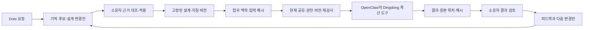

# Dots와 함께 일하는 Dingdong 0.2

2026-10-06 · 구현 및 검증 범위를 구분한 설계 기록.

**Dots가 사용자의 요청을 이해하고, Dingdong은 다음 작업에서도 사용할 업무 기준과 검증 가능한 실행 기록을 제공한다.** 사용자가 제공한 moa 제안 설계의 책임 분리를 따르되, 별도 저장소의 작은 클라우드 도구로 구현했다. 기존 moa 앱, 두 실행기와 카드뉴스 실험실을 새 프로젝트에 복사하거나 합치지 않았다.

## 제안에서 실제 동작으로

| 참고 설계의 방향 | Dingdong에서 구현한 계약 | 검증 수준 |
| --- | --- | --- |
| 출처가 있는 업무 기억 | core/episode, 후보/확정/대체/잊기, 유효기간, 버전별 원문 근거 | SQLite 재시작·검색·MCP 테스트 |
| 기억의 충돌 보존 | 같은 `claimKey`에 다른 확정 내용이 있으면 검색에서 제외하고 실행 차단, 모든 출처 버전을 대조해 해결 | 서버 테스트·실제 UI |
| 공통 지침 버전 | `InstructionSet` 이력과 프로젝트 연결, 자동화 저장 시 버전 고정 | 과거 실행 불변·DB 재시작 테스트 |
| 업무 맥락 묶음 | `WorkContext`의 ID, 입력 해시, 지침·기억, 실행 단계, 권한, 막힌 이유, 다음 행동, 상세 링크 | 만료·권한 변경·입력 변경 테스트 |
| 대화로 자동화 편집 | 새 설계/변경안과 필드별 diff, 소유자 적용, 기준 revision 재검사 | MCP → 실제 OpenClaw → 변경안·검토 |
| 실행 증거 | 결정적 발주·입고 대조, 입력·결과 SHA-256, 원본 행 참조 | 수량 계산·근거 읽기·UI·Gateway |
| 승인 경계 | 원격 승인 도구 제거, 소유자 화면의 실행·결과·만료와 결합된 검토 | 변조·오래된 기준·원격 승인 거부 테스트 |
| 연결 범위 | OAuth 클라이언트별 프로젝트와 5개 도구 권한, 즉시 회수 | 실제 HTTP/OAuth/MCP 통합 테스트 |
| 지속 개선 | 실제 실행의 피드백 → 기억 후보 → 소유자 검토 → 다음 설계 버전 | UI 및 실행 테스트 |
| 개인 dots 왕복 | 플러그인 생성·DCR·OAuth 동의 화면 도달 | 소유자 인증과 실제 개인 dot 호출은 미완료 |
| 상태 변경 알림 | SDK·프로토콜 요구사항 조사 | MCP Events 미구현 |

표의 Gateway 검증은 격리된 합성 자료로 실행했다. 개인 dots가 해당 도구를 선택하고 설명하는 행동을 검증했다는 뜻은 아니다.

## 실행 기준의 수명



공통 지침을 v2로 고쳐도 v1을 사용하던 자동화는 v1을 유지한다. 새 프로젝트 연결을 고르고 자동화를 새 버전으로 저장해야 바뀐다. 지침을 **회수**하면 그 지침을 참조한 새 실행과 대기 중 승인을 막고 반복도 중지한다.

확정된 장기 기준 전체의 해시를 자동화에 기록한다. 기준이 바뀌거나 만료되면 새 설계 버전을 저장·시험해야 반복을 다시 켤 수 있다. 각 실행은 조회한 기억의 실제 구간과 버전, 해석한 지침 내용을 함께 저장한다. 과거 결과는 현재 기억을 재조회해서 재구성하지 않는다.

자연어 지침은 Dots가 이해하고 설계할 자료다. 서버가 모든 문장의 의미를 판정하지 않는다. 발주 보류 제외·허용 수량 차이처럼 계산 가능한 조건은 `reconcile` 단계의 구조화된 규칙으로 별도 고정한다.

## WorkContext는 조회 기록이다

`work_context_get(projectId, workflowId, input)`은 15분 동안 유효한 조회 기록을 만든다. 다음 항목을 반환한다.

- 목적, 현재 설계·프로젝트 revision, 지침 버전과 내용, 확인된 기억과 출처.
- 입력 형식과 입력 해시, 실행 단계·실행자, 완료 조건.
- 충돌·회수·변경된 기준·미완료 실행 같은 차단 사유와 다음 행동.
- 호출한 연결의 현재 도구 권한, 소유자 화면으로 가는 링크.

시험 실행은 같은 호출자, 프로젝트, 자동화 revision, 입력, 연결 권한 revision과 현재 기준을 재검사한다. `contextId`만 알고 있어도 권한을 얻지 못한다. 권한 검사는 OpenClaw가 내부 명령을 돌려준 시점에 다시 적용되므로 대기 중 권한 회수도 반영한다. 같은 요청 키의 과거 결과를 돌려줄 때도 현재 접근 권한을 먼저 검사한다.

조회 기록 캐시는 7일 뒤 정리된다. 실행에 붙은 불변 사본은 남는다. 입력 원문은 원격 상태 요약에 포함하지 않는다.

## 기억의 변경과 충돌

기억 후보는 운영 기준을 바꾸지 않는다. 기존 기억을 대체하는 후보도 소유자가 확정하기 전에는 원래 기억을 유지한다. 확정 시 원래 기억 revision을 검사하므로 경쟁하는 제안 두 개가 조용히 덮어쓸 수 없다.

충돌은 명시적 `claimKey`의 정규화된 값이 같고 확정 내용이 다를 때만 탐지한다. 서로 다른 문장에서 모든 의미 충돌을 추론하는 시스템은 아니다. 충돌한 내용 양쪽을 보존하고 평상시 검색에서는 제외한다. 검토 화면은 출처·내용·revision을 함께 보여준다. 해결 요청은 검토한 모든 기억의 ID와 revision이 여전히 같은지 확인하고 선택하지 않은 기록은 조회에서 제외한다. 이후 새 자동화 버전으로 재검증한다.

기억의 출처 이름은 작성자가 제공한 주장이다. `run:` 참조, 원문 구간, 입력과 결과의 해시는 어느 데이터를 사용했는지 추적하는 증거이며 외부 파일의 진위나 출처 작성자의 권한을 독립적으로 보증하지 않는다.

OpenClaw에서 채택한 검색 원리와 측정 한계는 [별도 벤치마크](openclaw-memory-benchmark.md)에 기록했다. 원본 SQLite 레코드가 기준이고 FTS5 인덱스는 다시 만들 수 있다. OpenClaw의 꿈꾸기, 임베딩 또는 자동 승격을 구현했다고 주장하지 않는다.

## 연결마다 다른 권한

OAuth 동의와 관리 화면에서 공유 프로젝트와 다음 권한을 선택한다.

| 권한 | 허용 범위 |
| --- | --- |
| `context:read` | 공유된 업무의 기준·기억·설계·실행 요약 |
| `memory:propose` | 출처가 있는 기억 후보·실행 피드백 |
| `workflow:propose` | 적용 전의 새 설계·변경안 |
| `runs:trial` | 맥락을 조회한 저장 버전의 시험 실행 |
| `artifacts:read` | 허용된 실행 결과의 본문 구간 |

새 프로젝트 생성은 별도 선택이다. 활성화하면 생성한 새 프로젝트만 그 연결에 추가된다. 시험 전에 맥락을 읽으려면 `context:read`도 필요하다.

기억 확정, 설계 적용, 실행 승인, 반복 활성화, 공유 변경은 소유자 화면/API에서 처리한다. 원격 MCP 도구 목록에는 이러한 작업을 제공하지 않고 서버에서도 차단한다. 상태 요약은 결과 본문과 입력 원문을 제외하며, 결과 본문은 별도 권한으로 최대 12,000자씩 읽는다.

클라이언트마다 별도 계정/DB를 만드는 다중 사용자 제품은 아니다. 한 소유자의 워크스페이스에서 연결 앱에 공유할 범위를 제한하는 구조다.

## 발주·입고 대조로 확인하는 첫 업무

빌더에서 **발주·입고 대조 만들기**를 선택하거나 Dots가 `workflow_propose`로 제안한다. 계산 단계 뒤에 검토 단계를 두고, 계산 단계의 내용에는 다음 JSON 규칙을 저장한다.

```json
{"excludeHeld": true, "toleranceUnits": 0}
```

다음은 합성 시험 입력이며 사용자 데이터베이스에 자동으로 넣지 않는다.

```json
{
  "orderSource": "합성 발주 자료",
  "receiptSource": "합성 입고 자료",
  "orders": [
    {"lineId": "line-1", "sku": "BOOK-A", "quantity": 10},
    {"lineId": "line-2", "sku": "BOX-B", "quantity": 4, "hold": true}
  ],
  "receipts": [
    {"lineId": "line-1", "sku": "BOOK-A", "quantity": 8}
  ]
}
```

결과는 `BOOK-A: 발주 10 / 입고 8 / 부족 2`, 근거는 `orders[0]; receipts[0]`, 보류 제외는 1행이다. 같은 발주 행의 여러 입고는 합산한다. 발주에 없는 입고는 예외로 남긴다. 발주 행 ID 중복, 같은 행의 다른 상품 코드, 소수·음수 수량은 거부한다. 최대 각 300행, 수량 1,000,000개, 전체 입력 20,000자다. CSV·Excel 업로드나 거래처 API 수집은 아직 없다.

Dots는 저장된 설계에 대해 `work_context_get` → `run_start` → `run_get` → `artifact_get`을 사용한다. 제안은 소유자 적용 전까지 실행 가능한 자동화를 만들지 않는다. 결과 승인에는 24시간 검토 ID, 정확한 실행 스냅샷과 결과 해시, 현재 업무 기준 검사가 필요하다. 바뀐 기준이나 만료된 검토는 취소하고 다시 실행한다.

## 업그레이드와 남은 작업

0.1의 업무 데이터와 OAuth 등록을 유지한다. 지침 연결·기준 해시가 없는 기존 자동화는 수동 실행 시 새 맥락을 생성하지만, 반복을 다시 활성화하려면 새 버전 저장·시험이 필요하다. 이전 실행의 증거를 새 계약으로 꾸며내지 않는다. 기존 검토 기록은 소유자 화면에서만 이전 계약으로 처리할 수 있다.

기존 MCP 클라이언트는 명시적 공유 권한을 새로 설정해야 한다. 예전의 넓은 토큰 권한을 새 권한으로 자동 확대하지 않는다. 플러그인의 도구 목록도 새로 불러와야 한다.

예약의 소유자는 Dingdong 한 곳이며 24시간/7일 간격이다. “매일 오전 9시” 같은 달력 예약이나 Dots의 별도 예약과의 공동 소유를 구현하지 않는다.

공식 MCP Events는 2.0 프로토콜 `2026-07-28`과 구독·웹훅 검증을 요구한다. 현재 고정한 SDK 1.32.1은 `2025-11-25`를 지원한다. 이번 릴리스는 이벤트 지원을 광고하거나 웹훅 수신을 개인 dot 알림 성공으로 표시하지 않는다. 프로토콜 지원, 서명·재시도·outbox, 실제 계정 수신 검증이 후속 범위다.

개인 dots의 OAuth 소유자 인증과 실제 대화 도구 호출은 별도 완료 조건으로 남아 있다. MCP/실제 OpenClaw/클라우드 검증은 그 개인 계정 검증을 대신하지 않는다. 현재 결과는 [검증 기록](verification.md)에 구분했다.

공식 근거: [Dots 작업과 기억](https://learn.chatgpt.com/docs/dots/tasks-and-memory), [MCP 도구와 서버](https://developers.openai.com/plugins/build/mcp-server), [MCP Events](https://developers.openai.com/plugins/build/mcp-events), [MCP 인증](https://developers.openai.com/plugins/build/auth).
